```mermaid 
graph  TD;

A(INICIO)

B[Hallar la raiz cuadratica de un numero n]

C{El número es negativo?}

D{El número es cero?}

E[Seperar el número n en grupos de 2 de derecha a izquierda]

F[se busca un número entero que elevado al cuadrado, sea lo más cercano posible a el primer de grupo de cifras que se encuentra mas a a la izquierda]

G[Ese numero entero se toma como primer digito de la raiz cuadrada]

H[Se resta el cuadrado del número obtenido en el paso anterior al grupo de cifras que se está evaluando]

I{hay mas cifras?}

J[No se puede hallar raiz cuadra de un negativo]

K[Raiz cuadrada de cero es cero]

L[Bajar el siguiente par de cifras, y agregarlo a la cantidad restante del paso anterior]

M[Agregar 2 ceros a la cantidad restante del paso anterior]

W[Llamar a ese numero z]

m[Se duplica el resultado actual de la raíz cuadrada y se coloca a la derecha]

N[Se busca un número que, al agregarlo al número anterior y luego multiplicarlo por ese mismo,al restarlo por z, el resultado sea un numero positivo o cero];  n[Tomar el resultado de eso como x ]

O[El número que se encontro se toma como segundo dígito de la raíz cuadrada];  o[Tomar ese numero como y]

P[Se resta al número obtenido en el paso anterior las cifras que se bajaron]

Q{Hay mas cifras?}

R{El resultado de la raiz es exacto o ya tiene 3 decimales?}

S[Bajar el siguiente par de cifras, y agregarlo a la cantidad restante del paso anterior]

Z(Fin)

U[Ahora llamar a ese numero z]

T[Agregar una coma decimal, si ya hay una coma no agregar nada y hacer el siguiente paso]

t[Agregar dos ceros a la cantidad restante del paso anterior]

A-->B;

B-->C;  C--si-->J;  C--No-->D;  D--si-->K;  D--No-->E;  E-->F;  F-->G;  G-->H;  H-->I

I--si-->L;  I--no-->M

L-->W;  M-->W;  W-->m;  m-->N;  N-->n;  n-->O;  O-->o

o-->P;  Q--si-->S;  S-->U;  U-->m;  P-->Q

Q--No-->R;  R--si-->Z;  R--No-->t

T-->m;  t-->T
```

# UN RETO 4 ALGO COMPLICADO

El propósito de este repositorio es mostrar los diagramas de flujo y pseudocodigos que se piden en el reto 4
## Algoritmo de números primos hasta "n"
### Diagrama de flujo
```mermaid 
flowchart  TD;

A(Inicio)  -->  B[número n];

B  -->  C;

C[Tomar 2 como primer primo]  -->  D[Hacer lista desde 3 hasta n];

D  -->  E[i=3];

E-->F

F[Dividir i entre los primos anteriores]-->G

G{El residuo de alguna de las divisiones es cero?}--si-->H[i no es primo]

G--no-->I[i es primo];  I-->J[i=i+1]

H-->J;J-->K{i menor o igual a n?}

K--si-->F

K

--no-->M(fin)
  ``` 
  ### Pseudocodigo
  ```
  [variables]

n : entero

i : entero

p: Números primos anteriores

  
  

[inicio]

i := 3

p := [2] // Inicializar la lista de primos con el número 2

mientras (i < n) hacer

si existe un p tal que modulo(i,p) == 0 entonces

escribir("i no es primo")

sino

escribir("i es primo") y añadirlo a p

i := i + 1

fin mientras

[fin]
```

#### Ejemplo
Hallar los números primos hasta "n" con valor de 15
Lista de 3 hasta n: (3, 4, 5, 6, 7, 8, 9, 10, 11, 12, 13, 14, 15)

**2 es primer primo**

$\frac{3}{2}=1.5$: **3 es primo**

$\frac{4}{3}=1.3$, $\frac{4}{2}=2$ (residuo 0): **4 No es primo**

$\frac{5}{3}=1.66$, $\frac{5}{2}=2.5$: **5 es primo**

$\frac{6}{5}=1.2$, $\frac{6}{3}=2$ (residuo 0), $\frac{6}{2}=3$ (residuo 0): **6 no es primo**

$\frac{7}{5}=1.4$, $\frac{7}{3}=2.33$, $\frac{7}{2}=3.5$: **7 es primo**

$\frac{8}{7}=1.14$, $\frac{8}{5}=1.6$, $\frac{8}{3}=2.6$, $\frac{8}{4}=2$ (residuo 0): **8 no es primo**

$\frac{9}{7}=1.28$, $\frac{9}{5}=1.8$, $\frac{9}{3}=3$ (residuo cero), $\frac{9}{2}=4.5$: **9 no es primo**

$\frac{10}{7}=1.42$, $\frac{10}{5}=2$ (residuo 0), $\frac{10}{3}=3.33$, $\frac{10}{2}=5$ (residuo 0): **10 no es primo**

$\frac{11}{7}=1.57$, $\frac{11}{5}=2.2$, $\frac{11}{3}=3.66$, $\frac{11}{2}=5.5$: **11 es primo**

$\frac{12}{11}=1.09$, $\frac{12}{7}=1.71$, $\frac{12}{5}=2.4$, $\frac{12}{3}=4$ (residuo 0), $\frac{12}{2}=6$ (residuo 0), **12 no es primo**

$\frac{13}{11}=1.18$, $\frac{13}{7}=1.85$, $\frac{13}{5}=2.6$, $\frac{13}{3}=4.3$, $\frac{13}{2}=6.5$: **13 es primo**

$\frac{14}{13}=1.07$, $\frac{14}{11}=1.27$, $\frac{14}{7}=2$ (residuo 0), $\frac{14}{5}=2.8$, $\frac{14}{3}=4.66$, $\frac{14}{2}=7$ (residuo 0): **14 no es primo**

$\frac{15}{13}=1.15$, $\frac{15}{11}=1.36$, $\frac{15}{7}=2.14$, $\frac{15}{5}=3$ (residuo 0), $\frac{15}{3}=5$ (residuo 0), $\frac{15}{2}=7.5$, **15 no es primo**

**Números primos hasta 15: (2, 3, 5, 7, 11, 13)**


## Hallar raíces cuadradas con divisiones y restas
### Diagrama de flujo

### Pseudocodigo 
```


[variables]

N: entero

x: entero

y: entero

Z: entero

M: entero

raíz cuadrada: real

  

[inicio]

// Ingrese el valor de N

si N < 0 entonces

escribir("No se puede obtener la raíz cuadrada de un número negativo")

sino si N = 0 entonces

escribir("La raíz cuadrada de 0 es 0")

sino

// Separar el número en grupos de 2 de derecha a izquierda

// Se busca un número M que elevado al cuadrado se acerque al primer grupo de cifras que se encuentra a la izquierda

// El número M se toma como primer dígito de raíz cuadrada

// Se resta M^2 al grupo de cifras que se está evaluando

Separar N en grupos de 2 de derecha a izquierda

M := Entero(raíz(N))

Z := N - M^2

raíz cuadrada := M

mientras Z > 0 hacer

// Para cada grupo de cifras restantes:

// Se duplica el resultado actual de la raíz cuadrada

// Se busca un número Y, que al agregarlo al número anterior y luego multiplicarlo por ese mismo, al restarlo por Z, el resultado sea un número positivo o cero

// Se agrega Y al resultado de la raíz

// Se resta Y * (raíz cuadrada * 2 + Y) * 10^(2 * número de grupos restantes) a Z

// Si Z es cero, se han calculado todos los dígitos de la raíz cuadrada

// En caso contrario, se continúa con el siguiente grupo de cifras restantes

Z := Z * 100

x := 0

y := 1

mientras (2 * raíz cuadrada + y) * y <= Z hacer

y := y + 1

fin mientras

y := y - 1

raíz cuadrada := raíz cuadrada * 10 + y

x := (2 * raíz cuadrada + y) * y

Z := Z - x

fin mientras

// Mostrar resultado

escribir("La raíz cuadrada de ", N, " es ", raíz cuadrada)

fin si

[fin]
```

#### Ejemplo
n=149
Hallar $\sqrt{149}$
1. Se cumplen las condiciones de que "149" no es negativo, y tampoco es cero
2. Se divide el numero en dos de derecha a izquierda:
"01" y "49"
3. Se busca un numero entero que elevado al cuadrado de "01" o se aproxime, debido a que se coge el primer par de números de izquierda a derecha. En esta caso el numero entero elevado al cuadrado que se aproxima es 1 ya que $1^2=1$
4. Se toma el "1" que acabamos de encontrar como primer numero para el resultado de la raíz entonces: 
 $\sqrt{149}=1$
 5. Se resta el cuadrado del numero entero que encontramos y lo restamos por el primer par de cifras asi:
$\sqrt{149}=1$
  $01$
-$1$
$-------$
 $0$
 6. Como todavía hay cifras bajamos las siguientes y nos queda, a este número lo llamaremos "Z"
 $049$
 7. Se duplica el resultado actual de la raíz cuadrada que es "1"
 $1*2=2$
 8. Se busca un número que, al agregarlo al número anterior y luego multiplicarlo por ese mismo, al restarlo por Z, el resultado sea un numero positivo o cero
 $21*1=21$ Menor que Z
 $22*2=44$  Menor que Z
 $23*3=69$ Mayor que Z
 Tomamos el 2 debido a que es el mayor numero que no se pasa de Z
 Asi que restamos $49-44=5$
 9. se toma el 2 como segundo dígito de la raíz cuadrada
 $\sqrt{149}=12$ 
 10. Como no hay mas dígitos nos preguntamos si el resultado ya es exacto, así que para comprobar elevamos nuestro resultado al cuadrado
 $12^2=144$
 como vemos que no es exacto, vamos a sacar decimales para aproximarnos mas al resultado
 11. Al residuo de la resta del paso 8 le agregamos dos ceros, quedando "500" a este numero ahora lo llamaremos "Z"
 12. se vuelve a hacer el paso 7, en donde duplicamos el resultado actual que tenemos de la raíz  que es "12" quedando:
$12*2=24$
 13. Se busca un número que, al agregarlo al número anterior y luego multiplicarlo por ese mismo,al restarlo por Z, el resultado sea un numero positivo o cero
$241*1=241$ Menor que Z
$242*2=484$ Menor que Z
$243*3=729$ Mayor que Z
 Tomamos el 2 debido a que es el mayor numero que no se pasa de Z
 Asi que restamos $500-484=16$
 14. Se toma el 2 como decimal de la raíz quedando:
  $\sqrt{149}=12.2$ 
  Aunque se puede seguir sacando decimales infinitamente se demuestra que el metodo es eficiente debido a que:
  $(12.2)^2=148.84$
  Lo cual es bastante cercano a 149
  ------------------------
  Muchas gracias por leer fin del repositorio :D
  ### #Viva Pyth-Ohm


